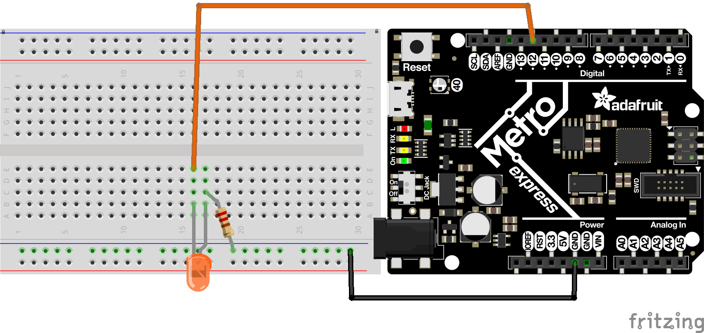
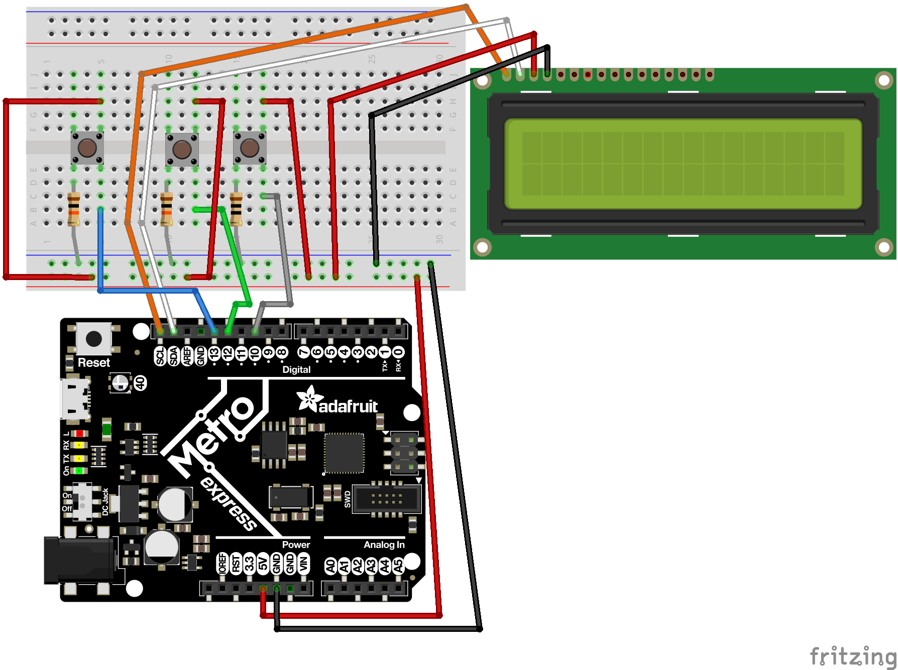
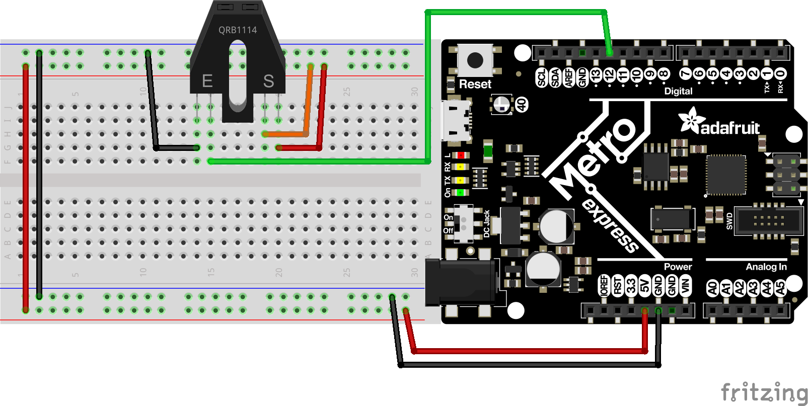
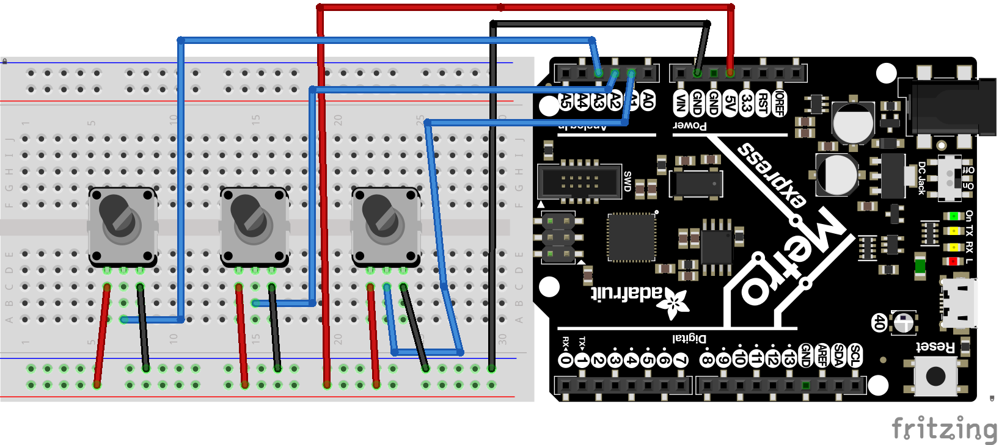
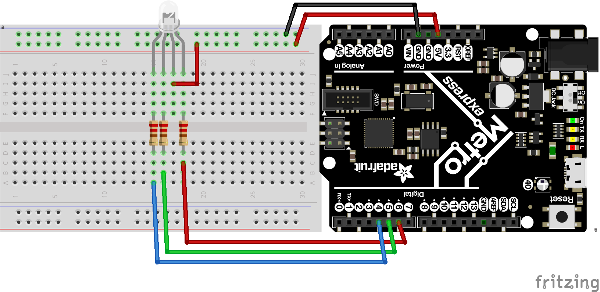
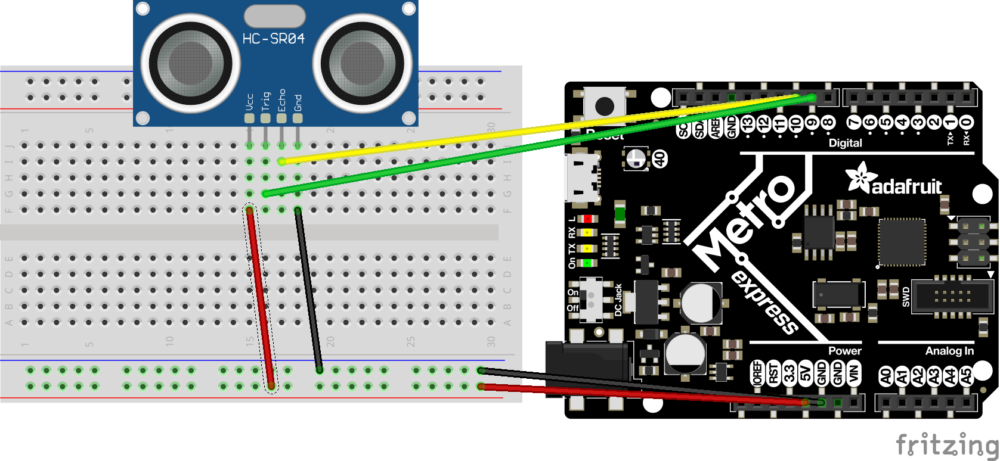
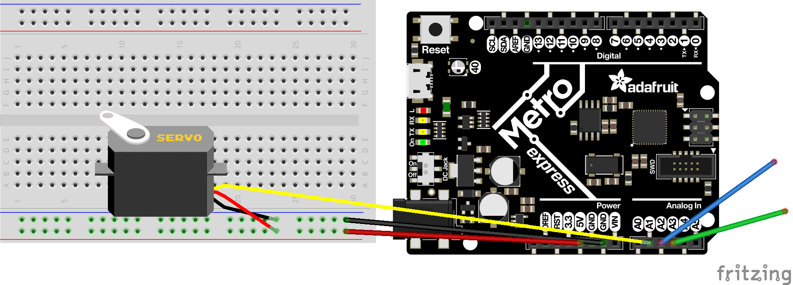

# **CircuitPython**

All of my CircuitPython code is here.

---

### Quick Access

- [Overview of all code](https://github.com/clyman88/Engineering-3/tree/master/CircuitPython#overview-of-all-code)
    - [fade.py](https://github.com/clyman88/Engineering-3/blob/master/CircuitPython/README.md#fadepy)
    - [fancyLED.py](https://github.com/clyman88/Engineering-3/blob/master/CircuitPython#fancyLEDpy)
    - [fancyLED_main.py](https://github.com/clyman88/Engineering-3/tree/master/CircuitPython#fancyled_mainpy)
    - [fish_class.py](https://github.com/clyman88/Engineering-3/blob/master/CircuitPython#fish_classpy)
    - [hello_vs_code](https://github.com/clyman88/Engineering-3/blob/master/CircuitPython#hello_vs_codepy)
    - [lcd_assignment.py](https://github.com/clyman88/Engineering-3/blob/master/CircuitPython/README.md#lcd_assignmentpy)
    - [photo_interrupter.py](https://github.com/clyman88/Engineering-3/blob/master/CircuitPython/README.md#photo_interrupterpy)
    - [pot_rgb_adjusters.py](https://github.com/clyman88/Engineering-3/blob/master/CircuitPython/README.md#pot_rgb_adjusterspy)
    - [rgb.py](https://github.com/clyman88/Engineering-3/tree/master/CircuitPython#rgbpy)
    - [rgb_main.py](https://github.com/clyman88/Engineering-3/tree/master/CircuitPython#rgb_mainpy)
    - [sensor.py](https://github.com/clyman88/Engineering-3/blob/master/CircuitPython/README.md#sensorpy)
    - [servo_touch.py](https://github.com/clyman88/Engineering-3/blob/master/CircuitPython/README.md#servo_touchpy)
- [Folders](https://github.com/clyman88/Engineering-3/tree/master/CircuitPython#folders)
    - [fritzing_models](https://github.com/clyman88/Engineering-3/blob/master/CircuitPython/README.md#fritzing_models)
- [Other Files](https://github.com/clyman88/Engineering-3/tree/master/CircuitPython#other-files)
    - [agenda.md](https://github.com/clyman88/Engineering-3/blob/master/CircuitPython/README.md#agendamd)
    - [README.md](https://github.com/clyman88/Engineering-3/blob/master/CircuitPython/README.md#READMEmd)

---

## Overview of all code

The CircuitPython code in this repository is run on a fancy little thing called...
> ...a Metro M0 Express and at first glance, you might think it's just an Arduino with a new paint job.  Au contraire!
>
> 
> 
> [Source](https://cvilleschools.instructure.com/courses/26602/assignments/173747?module_item_id=480883)

The Metro M0 Express is specifically designed for CircuitPython - a version of Python. You could say it's pretty neat, if you felt so inclined.

Here's a brief rundown of each file:

---

### [fade.py](https://github.com/clyman88/Engineering-3/blob/master/CircuitPython/fade.py)

[fade.py](https://github.com/clyman88/Engineering-3/blob/master/CircuitPython/fade.py) is a very basic file with the purpose of making an LED fade On and Off.
That's pretty much it. The code is not too complicated; the only difficult bit was understanding how the PWMOut object operated. After that it's basic Python loops if statements.

#### Takeaways/Things to remember 

The syntax for declaring PWMOut objects is as follows: 

~~~python
led = pulseio.PWMOut(board num, frequency num (usually 500), duty_cycle num, variable_frequency = bool)
~~~

The board number is self-explanatory, the frequency number is the target frequency in Hertz, the duty_cycle is how much of one cycle is high (int between 0 and 2 ** 16), and the variable_frequency determines whether the frequency is constant or not. 

For example, setting the above led as a variable and setting it to full brightness goes as follows:

~~~python
led = pulseio.PWMOut(board.D13, frequency=500, duty_cycle=0)

while True:
    led.duty_cycle(2 ** 16)
~~~

#### Fritzing model

>

---

### [fancyLED.py](https://github.com/clyman88/Engineering-3/blob/master/CircuitPython/fancyLED.py)

[fancyLED.py](https://github.com/clyman88/Engineering-3/blob/master/CircuitPython/fancyLED.py) is a pretty cool class that will make a group of three LEDs do various things (specifically alternate, blink, chase, and sparkle). The code is relatively complicated, but that's my own doing because for some reason I insisted on doing things the hard way. With complicated code came a lot of troubleshooting and testing, so this assigment took a bit longer than it probably should have. Overall, the code works, and while it's a bit of an eyesore, again, it works.

#### Takeaways/Things to remember

The main thing this assignment taught me was how to utilize classes. Class code normally goes as follows:

~~~python
 Class(object):

    def __init__(x, y, z):
        self.x = x
        self.y = y
        self.z = z

    def func1(self):
        pass

    def func2(self, a, b):
        pass
~~~

Then when calling a class, code normally goes as follows:

~~~python
var = Class(x, y, z)

while True:
        
    var.func1()
    var.func2(a, b)
~~~

#### Fritzing model:

>

---

### [fancyLED_main.py](https://github.com/clyman88/Engineering-3/blob/master/CircuitPython/fancyLED_main.py)

[fancyLED_main.py](https://github.com/clyman88/Engineering-3/blob/master/CircuitPython/fancyLED_main.py) is the main file associated with running the fancyLED.py file and demonstrates the utilization of the class features detailed in the takeaways section of this [description](https://github.com/clyman88/Engineering-3/blob/master/CircuitPython#fancyLEDpy).

---

### [fish_class.py](https://github.com/clyman88/Engineering-3/blob/master/CircuitPython/fish_class.py)

[fish_class.py](https://github.com/clyman88/Engineering-3/blob/master/CircuitPython/fish_class.py) is a bit of code that, while not actually an assignment was a fun class that I made about fish. The notable bits of the code were figuring out edibility, which altogether took me way to long to both figure out and actually implement into the class.

---

### [hello_vs_code](https://github.com/clyman88/Engineering-3/blob/master/CircuitPython/fish_class.py)

[hello_vs_code](https://github.com/clyman88/Engineering-3/blob/master/CircuitPython/fish_class.py) is a file for the primary purpose of learning how vs code works. That being said, the code looks really sad. 

---

### [lcd_assignment.py](https://github.com/clyman88/Engineering-3/blob/master/CircuitPython/lcd_assignment.py)

[lcd_assignment.py](https://github.com/clyman88/Engineering-3/blob/master/CircuitPython/lcd_assignment.py) is a file with the purpose of displaying a number that would increase by different modifiers when a button was pushed based on the current modifier (also determined by a button). I also included
a reset button that reset the modifier to 1 and number to 0 because that's just how quirky I am. The only part of this assignment that was a pain was the lcd libraries and the apparent lack of memory for
the poor Metro M0 Express. Updating the libraries and clearing it of uneccesary junk was tedious but was effective in the long run.

#### Takeaways/Things I learned:

LCD's are a little bit of a pain. They take up space and the code is a little bit of a hassle, so here's the basic code for importing and using LCD's for CircuitPython:

~~~python
from lcd.lcd import LCD
from lcd.i2c_pcf8574_interface import I2CPCF8574Interface
from lcd.lcd import CursorMode

lcd = LCD(I2CPCF8574Interface(0x27), num_rows=2, num_cols=16)

row = 0
column = 0

while True:

    lcd.set_cursor_pos(row, column)
    lcd.print("Hello world!")
    lcd.clear()
~~~

This was the first time I used buttons, so here's the DigitalInOut code format for buttons as well:

~~~python
button = DigitalInOut(board.D4)
button.direction = Direction.INPUT
button.pull = Pull.UP

while True:

    if not button.value:
        print("Button pressed")

    elif button.value:
        print("Button not pressed")
~~~

#### Fritzing model:

>

---

### [photo_interrupter.py](https://github.com/clyman88/Engineering-3/blob/master/CircuitPython/photo_interrupter.py)

[photo_interrupter.py](https://github.com/clyman88/Engineering-3/blob/master/CircuitPython/photo_interrupter.py) is a file that spits out the number of interrupts
a photo_interrupter has experienced every four seconds (without using the time.sleep() function).
The main difficult part of the assignment was checking only every four seconds without using the aforementioned function, making me use some very messy and unconventional methods of variable comparison that I'm afraid
has just become my style of code.

#### Takeaways/Things I learned:

Not using the time.sleep() function was a bit of a curveball, but using the universal second counter also found in the time function worked effectively. I'll definitely use that function in the future. Also, photointerrupters are relatively simple to use/code, but here's the code for both the time function and photointerrupters:

~~~python
photointerrupter = DigitalInOut(board num)
photointerrupter.direction = Direction.INPUT
photointerrupter.pull = Pull.UP
~~~

#### Fritzing model:

>

---

### [pot_rgb_adjusters.py](https://github.com/clyman88/Engineering-3/blob/master/CircuitPython/pot_rgb_adjusters.py)

A fun just-for-kicks assignment where you can change the neopixel color with three potentiometers for r, g, and b values.

#### Takeaways/Things I learned:

I learned about the AnalogIn object. Here's the bare-bones rundown of how the code normally works (at least for this file):

~~~python
potentiometer1 = AnalogIn(board num)

while True:

    print(potentiometer1.value) # number between 0 and (2^16)-1
~~~

#### Fritzing model:

>

---

### [rgb.py](https://github.com/clyman88/Engineering-3/blob/master/CircuitPython/rgb.py)

[rgb.py](https://github.com/clyman88/Engineering-3/blob/master/CircuitPython/rgb.py) is a file with a custom-made RGB class, which is meant to change the color of RGB LED's depending on the various functions used. The functions' functions include turning the LED red, green, blue, cyan, magenta, and yellow, and making the LED cycle through different colors at two different rates.

#### Takeaways/Things I learned

>"You wire a common anode RGB LED by setting the common pin to 5 V. Then you **set the pins you want OFF also to 5 V**. The **pin you want on, you set to GROUND**. Current flows from the common 5 V to the grounded pins" - Doctor Shields, 2019

Thank you, Doctor Shields, for so concisely articulating what I learned in this assignment!

This was also the first assignment working with classes, so I also learned how to interact with CircuitPython through classes.

#### Fritzing model:

>

---

### [rgb_main.py](https://github.com/clyman88/Engineering-3/blob/master/CircuitPython/rgb_main.py)

[rgb_main.py](https://github.com/clyman88/Engineering-3/blob/master/CircuitPython/rgb_main.py) is the main file associated with running the rgb.py file and demonstrates the utilization of the class features detailed in the takeaways section of this [description](https://github.com/clyman88/Engineering-3/blob/master/CircuitPython#rgbpy).

---

### [sensor.py](https://github.com/clyman88/Engineering-3/blob/master/CircuitPython/sensor.py)

[sensor.py](https://github.com/clyman88/Engineering-3/blob/master/CircuitPython/sensor.py) was a super fun assignment (there's no sarcastic font but just use your imagination).
The assignment was to have a sensor read the distance between itself and the closest object, changing the
neopixel color along a spectrum as the sensor distance gets higher. The sensor wasn't too complicated to code, and looking 
at the HCSR04 library told me how to use it. The red, green, and blue color spectrum had me scratching my head for a little while, but in the end
I found a clean(ish) solution.

~~~python
if dist <=15:
    r = 255-(17*dist)
    b = 0+(17*dist)
    g = 0
    
elif dist > 15:
    b = 255-(17*(dist-15))
    g = 0+(17*(dist-15))
    r = 0
~~~

Essentially "mapping" the values gotten from the sensor to possible r, g, and b values neatly accomplished the objective.

#### Takeaways/Things I learned

Sensors are a bit wonky in CircuitPython. This is largely due to some odd(ish) coding in the library, but in the end it's fairly straightforward. I also learned an effective way to map variables (as detailed above). Here's the sensor code:

~~~python
from adafruit_hcsr04 import HCSR04
sensor = HCSR04(board.D6, board.D5)
distance = 0

while True:

    try:
        distance = int(sensor.distance)
    except RuntimeError:
        pass

    print(distance)
~~~

#### Fritzing model:

>

---

### [servo_touch.py](https://github.com/clyman88/Engineering-3/blob/master/CircuitPython/servo_touch.py)

[servo_touch.py](https://github.com/clyman88/Engineering-3/blob/master/CircuitPython/servo_touch.py) is the code for an assignment where touching
one wire moves the servo in one direction while touching the other wire moves the servo in the opposing direction. I spiced up the assignment
a small amount by changing the neopixel color depending on what color the servo was turning. The only strange part about the assignment
was learning about how TouchIn objects functioned, but it was smooth sailing after that.

#### Takeaways/Things to remember

Servos! What a little bundle of joy these discount-motors are to code, use, and admire!

Servos are pretty easy to use, but for future reference here's the basic code for programming servos:

~~~python
from adafruit_motor import servo

pwm = pulseio.PWMOut(board #, duty_cycle= 2**15, frequency=50)
my_servo = servo.Servo(pwm)

while True:

    for i in range(0, 180):
        my_servo.angle = i
~~~

Also, I learned all about touch objects. Do I understand how they work? No! Here's the code anyway:

~~~python
import touchio

touch_wire = touchio.TouchIn(board # (analog))

while True:
        
    if touch_wire.value:
        print("Touched!")

    elif not touch_wire.value:
        print("Not being touched!")
~~~

#### Fritzing model:

>

---

## Folders

Here is a rundown of the folders in the CircuitPython branch of this repository:

---

### [fritzing_models](https://github.com/clyman88/Engineering-3/blob/master/CircuitPython/fritzing_models/)

[fritzing_models](https://github.com/clyman88/Engineering-3/blob/master/CircuitPython/fritzing_models/) is the home for all of my lil' Fritzing models you've hopefully been seeing in this document. The folder contains both the Fritzing files and the .png versions.

---

## Other Files

There are just a few other files in the CircuitPython folder. Here is the brief overview of what each one does:

---

### [agenda.md](https://github.com/clyman88/Engineering-3/blob/master/CircuitPython/agenda.md)

The [agenda.md](https://github.com/clyman88/Engineering-3/blob/master/CircuitPython/agenda.md) is currently a list of what needs to be done
in the CircuitPython folder. Formatting is in progress to be more easy to use and make it more perdy.

---

### [README.md](https://github.com/clyman88/Engineering-3/blob/master/CircuitPython/README.md)

The [README.md](https://github.com/clyman88/Engineering-3/blob/master/CircuitPython/README.md) is what you're reading right now. It
gives an overview of all the files in this folder and what their purpose is.

